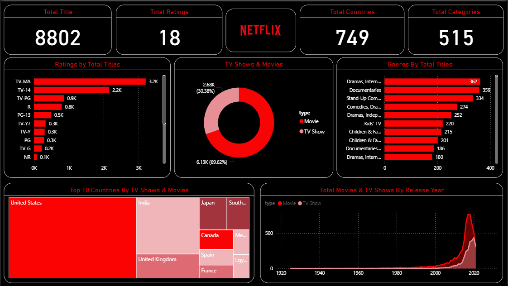
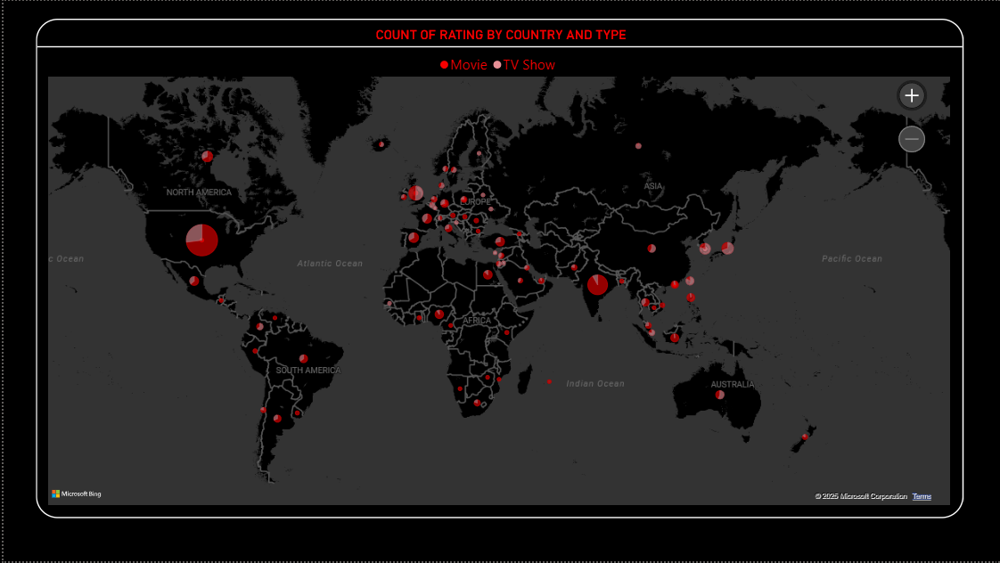

# 🎬 Netflix Data Analysis Dashboard

### 📊 Project Overview
This project presents an interactive **Power BI Dashboard** that analyzes the **Netflix content dataset** to uncover trends across genres, countries, release years, and content types (Movies vs TV Shows).  
The dashboard helps visualize **how Netflix’s library evolved**, which countries contribute most to content, and what ratings dominate the platform.

---

### ⚙️ Technologies Used
- **Power BI** — Dashboard design and interactive visualization  
- **Python (Pandas, NumPy)** — Data cleaning and preprocessing  
- **Microsoft Excel** — Initial data exploration  
- **Data Source:** Kaggle Netflix Titles Dataset  

---

### 🎯 Key Insights
- **Total Titles:** 8,802 | **Total Ratings:** 18 | **Total Countries:** 749 | **Total Categories:** 515  
- Majority of content is **Movies (≈70%)**, followed by **TV Shows (≈30%)**  
- Most common ratings: **TV-MA** and **TV-14** dominate Netflix’s catalog.  
- **United States, India, and the United Kingdom** produce the highest number of titles.  
- **Dramas** and **Documentaries** are the leading genres globally.  
- Sharp content growth after **2015**, peaking around **2020**.  

---

### 🗺️ Dashboard Previews
#### 📍 Dashboard Overview

#### 🌎 Map View by Country

---

### 📈 Dashboard Features
- **Interactive filters** by rating, genre, and country  
- **Dynamic KPI cards** showing total titles, ratings, countries, and categories  
- **Geographical view** of Netflix presence and production distribution  
- **Year-wise trend analysis** for content release patterns  

---

### 📚 How to Use
1. Download the `Netflix data analysis.pbix` file.  
2. Open it in **Power BI Desktop** (latest version).  
3. Explore insights using interactive slicers and visuals.

---

### 🧠 Learning Highlights
- Data cleaning and transformation using **Power Query Editor**  
- Data modelling and relationship management  
- Storytelling through visual hierarchy and color consistency  
- Understanding global entertainment trends through data  

---

### 📬 Contact
👤 **Pruthviraj V Mariguddi**  
📧 [pruthvirajmariguddi@gmail.com](mailto:pruthvirajmariguddi@gmail.com)  
🔗 [LinkedIn]([linkedin.com/in/pruthviraj-v-mariguddi-5b647228a](https://www.linkedin.com/in/pruthviraj-v-mariguddi-5b647228a/))
